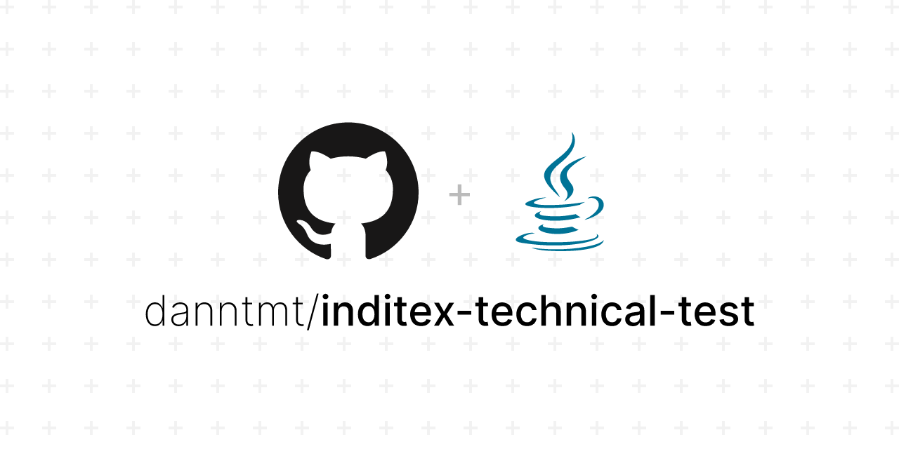
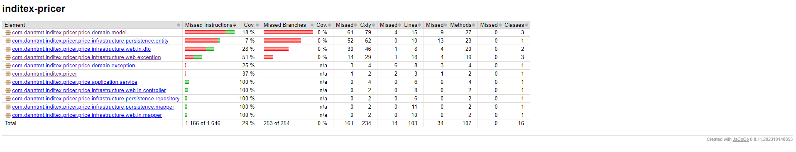
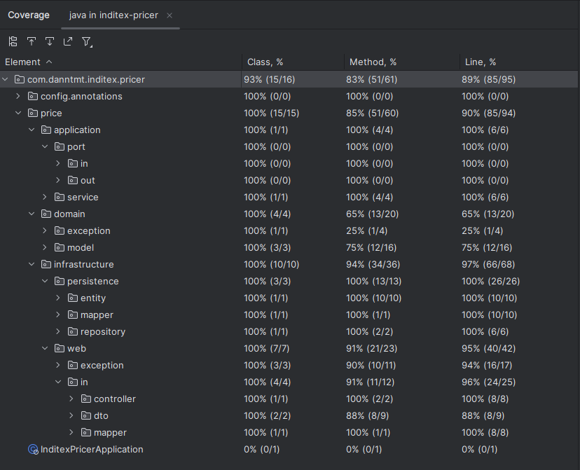

<h1 align="center" id="title">Inditex Pricer Application</h1>

<p align="center">

</p>

## 📰  Project description
This project implements a Spring Boot application that provides a REST service for querying product prices in an e-commerce database. A hexagonal architecture has been used to organize the application in a modular and maintainable way.

The diagram of the application is shown below.


## 💾 Database Description
The application uses an in-memory H2 database with the following table structure:

### PRICES
| brand_id | start_date          | end_date             | price_list | product_id | priority | price | currency |
| :------: | :-----------------: | :------------------: | :--------: | :--------: | :------: | :---: |:--------:|
| 1        | 2020-06-14-00.00.00 |	2020-12-31-23.59.59 |	1        |  35455	|   0	     | 35.50 |   EUR    |
| 1        | 2020-06-14-15.00.00 |	2020-06-14-18.30.00 |	2        |	35455   |	1        | 25.45 |   EUR    |
| 1        | 2020-06-15-00.00.00 |	2020-06-15-11.00.00 |	3        |	35455   |	1        | 30.50 |   EUR    |
| 1        | 2020-06-15-16.00.00 |	2020-12-31-23.59.59 |	4        |	35455   |	1        | 38.95 |   EUR    |

### Fields:

- *brand_id*: Chain group identifier (1 = ZARA).
- *start_date*, end_date: Range of dates for which the indicated price rate applies.
- *price_list*: Identifier of the applicable price rate.
- *product_id*: Product code identifier.
- *priority*: Price application disambiguator. If two rates coincide within a date range, the one with the higher priority (higher numeric value) is applied.
- *price*: Final selling price.
- *currency*: ISO currency.

## 🎯 REST Endpoints
The application provides a REST endpoint for querying prices. The input parameters are the application date, the product identifier, and the brand identifier. The output data includes the product identifier, brand identifier, rate to apply, application dates, and final price to apply.

The endpoint has the following structure:

```http request
GET /api/v1/prices/brand/{brandId}/product/{productId}?date={date}
```

***Try it yourself once you initialise, with the search_prices.http file in the http folder.***

### Input Parameters
- **brandId**: Brand identifier.
- **productId**: Product identifier.
- **date**: Application date.

***You can find the documentation of the application made with OpenAPI in the path http://localhost:8009/swagger-ui/index.html once you have initialised the application.***

## 🧪 Tests
A parameterised integration test (FindPriceControllerTest) has been developed, which tests the following search queries:

- Test 1: Request at 10:00 on the 14th for product 35455 for brand 1 (ZARA).
- Test 2: Request at 16:00 on the 14th for product 35455 for brand 1 (ZARA).
- Test 3: Request at 21:00 on the 14th for product 35455 for brand 1 (ZARA).
- Test 4: Request at 10:00 on the 15th for product 35455 for brand 1 (ZARA).
- Test 5: Request at 21:00 on the 16th for product 35455 for brand 1 (ZARA).

### Jacoco report


### Intellij Test Coverage Report


## 🛠️ Technologies Used

### Java 17
Because the latest does not always mean the best.

Java 17 is an LTS release, which means that you will receive security updates and bug fixes over an extended period. This is particularly important for business-critical applications that require long-term stability and maintenance.

It also incorporates enhancements that we do not have in Java 8 for example, such as sealed interfaces and classes, functional switch, string validation methods such as .isBlank() and a significant increase in JVM performance.

### Spring Boot 3
These are some of the many reasons why Spring Boot has been chosen as the development framework:

- Simplifies Configuration
- Fast and Easy Development
- Integration with Spring Ecosystem
- Embedded Containers
- Automatic Dependency Management
- Microservices support
- Integrated Security
- Active Community and Extensive Documentation

***One of the new features of this release is Native Image support, which was one of the most eagerly awaited changes with the update. 
With Spring Boot 3.0, developers can convert applications directly to GraalVM native image. 
The native image enables fast application boot times, which translates into considerable improvements in memory consumption.***

*In addition, Spring Boot 3 is only valid with Java version 17 or higher.*

### H2 Database (In-memory)
These are some of the many reasons why using an h2 database is a good idea for a Minimum Viable Product:

- Lightweight and embedded:
- Ease of configuration.
- Support for various modes of operation: both in-memory and in file mode
- Support for SQL standards
- Good documentation:
- Open source licence
- Support for different data types
- Acceptable performance for small workloads

### Code coverage with SonarQube and JaCoCo
SonarQube is an open-source and standalone service that gives an overview of the overall health of our source code by measuring code quality and code coverage.

SonarQube and JaCoCo are two tools that we can use together to make it easy to measure code coverage.


## ▶️ Execution

#### To run the application, use the following command inside the root directory of the project:

```bash
./mvnw spring-boot:run
```

The application will be available at http://localhost:8089. (If you want to change the port, you must do so in the application.yml, in the server section.port)

#### Compile and test

```bash
./mvnw clean test
```

#### Building and Packaging
To build and package the application, use:

```bash
./mvnw clean package
```
This will generate a JAR file in the target directory.

###### Note: Make sure you have Java 17 and Maven installed on your system before running

## 📦 Dockerization

You can build an image with the following command:

```bash
docker build -t inditex-pricer -f docker/Dockerfile .
```
and run it by running the following command:

```bash
docker run  -p 8009:8009 inditex-pricer
```