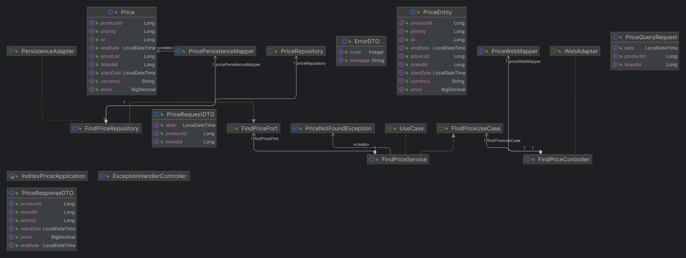

# Inditex Pricer Application

This project implements a Spring Boot application that provides a REST service for querying product prices in an e-commerce database. A hexagonal architecture has been used to organize the application in a modular and maintainable way.

The diagram of the application is shown below.


## Database Description
The application uses an in-memory H2 database with the following table structure:

### PRICES
| brand_id | start_date          | end_date             | price_list | product_id | priority | price | curr |
| :------: | :-----------------: | :------------------: | :--------: | :--------: | :------: | :---: | :--: |
| 1        | 2020-06-14-00.00.00 |	2020-12-31-23.59.59 |	1        |  35455	|   0	     | 35.50 |  EUR |
| 1        | 2020-06-14-15.00.00 |	2020-06-14-18.30.00 |	2        |	35455   |	1        | 25.45 |	EUR |
| 1        | 2020-06-15-00.00.00 |	2020-06-15-11.00.00 |	3        |	35455   |	1        | 30.50 |	EUR |
| 1        | 2020-06-15-16.00.00 |	2020-12-31-23.59.59 |	4        |	35455   |	1        | 38.95 |	EUR |

### Fields:

- brand_id: Chain group identifier (1 = ZARA).
- start_date, END_DATE: Range of dates for which the indicated price rate applies.
- price_list: Identifier of the applicable price rate.
- product_id: Product code identifier.
- priority: Price application disambiguator. If two rates coincide within a date range, the one with the higher priority (higher numeric value) is applied.
- price: Final selling price.
- curr: ISO currency.

## REST Endpoints
The application provides a REST endpoint for querying prices. The input parameters are the application date, the product identifier, and the chain identifier. The output data includes the product identifier, chain identifier, rate to apply, application dates, and final price to apply.

The endpoint has the following structure:

```http request
GET /api/v1/prices/brand/{brandId}/product/{productId}?date={date}
```
### Input Parameters
- brandId: Brand identifier.
- productId: Product identifier.
- date: Application date.

*You can find the documentation of the application made with OpenAPI in the path http://localhost:8009/swagger-ui/index.html once you have initialised the application.*

## Tests
Tests have been developed to validate the following requests to the service:

- Test 1: Request at 10:00 on the 14th for product 35455 for brand 1 (ZARA).
- Test 2: Request at 16:00 on the 14th for product 35455 for brand 1 (ZARA).
- Test 3: Request at 21:00 on the 14th for product 35455 for brand 1 (ZARA).
- Test 4: Request at 10:00 on the 15th for product 35455 for brand 1 (ZARA).
- Test 5: Request at 21:00 on the 16th for product 35455 for brand 1 (ZARA).

## Technologies Used
- Java 17
- Spring Boot 3
- H2 Database (In-memory)

## Execution

#### To run the application, use the following command:

```bash
./mvnw spring-boot:run
```

The application will be available at http://localhost:8089. (If you want to change the port, you must do so in the application.yml, in the server section.port)

#### Compile

```bash
./mvnw clean compile
```

#### Building and Packaging
To build and package the application, use:

```bash
./mvnw clean package
```
This will generate a JAR file in the target directory.

###### Note: Make sure you have Java 17 and Maven installed on your system before running 

## Dockerization

You can build an image with the following command:

```bash
docker build -t inditex-pricer -f docker/Dockerfile .
```
and run it by running the following command:

```bash
docker run  -p 8009:8009 inditex-pricer
```